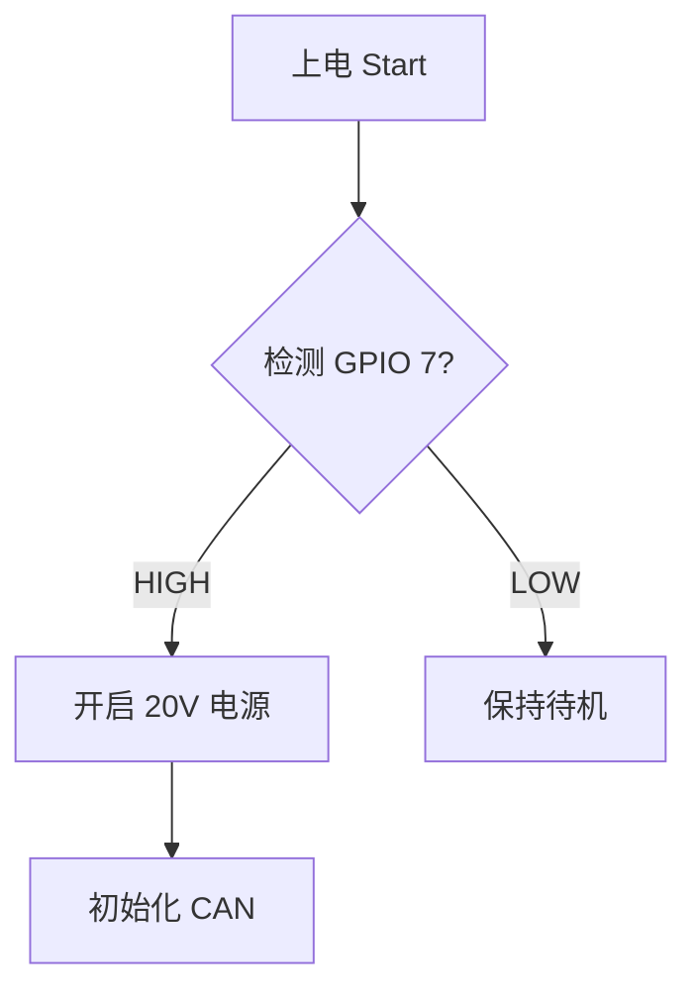
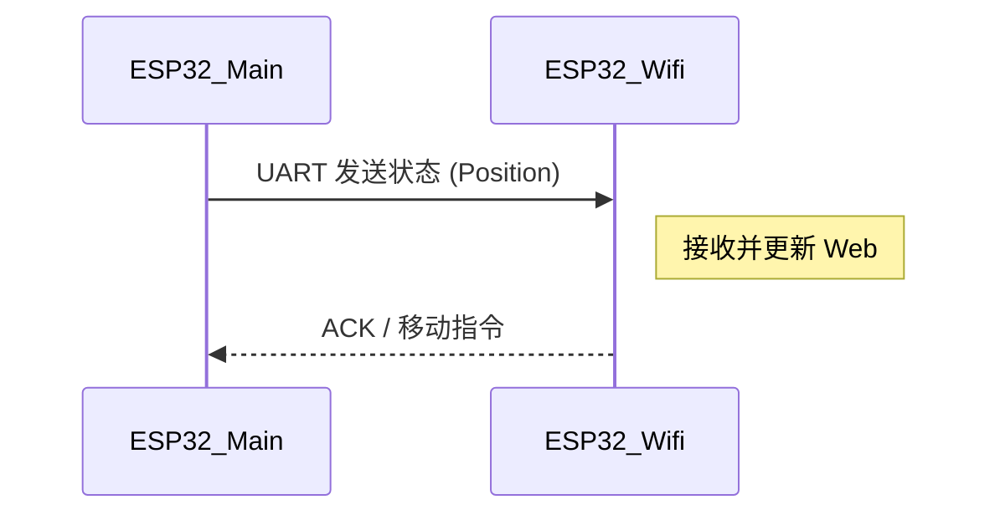

这是一个 **Markdown 语法速查表 (Cheat Sheet)**。
特别优化了**代码块**、**流程图 (Mermaid)** 和**表格**部分，方便在笔记中记录代码片段、通信协议和硬件逻辑。

***


# Markdown 语法速查表

## 1. 文本样式 (Text Styling)

| 效果        | 语法示例         | 说明                   |
| :-------- | :----------- | :------------------- |
| **加粗**    | `**加粗文本**`   | 常用                   |
| *斜体*      | `*斜体文本*`     | 常用                   |
| ***粗斜体*** | `***粗斜体***`  | 强调                   |
| ~~删除线~~   | `~~删除线~~`    | 用于标记废弃参数             |
| ==高亮==    | `==高亮文本==`   | (Obsidian/Typora 支持) |
| `行内代码`    | `` `行内代码` `` | 标记变量名、引脚号            |

---

## 2. 标题 (Headers)

```markdown
# 一级标题 (文档名为 H1)
## 二级标题 (模块/章节)
### 三级标题 (小节)
#### 四级标题 (细节)
```

---

## 3. 代码块 (Code Blocks) - 核心部分

对于嵌入式开发，务必在反引号后指定语言（如 `cpp`, `c`, `python`, `bash`）以获得高亮。

**C/C++ 代码示例：**

```cpp
// ```cpp
void setup() {
    // 初始化 CAN 收发器
    pinMode(27, OUTPUT); // STBY
    digitalWrite(27, HIGH);
}
// ```
```

**JSON/协议示例：**

```json
// ```json
{
  "command": "0xA3",
  "payload": "0x00FF"
}
// ```
```

**Diff (代码对比) 示例：**

```diff
// ```diff
- #define CAN_TX 4  // 旧设计
+ #define CAN_TX 26 // 新设计 (Pulsar)
// ```
```

---

## 4. 列表 (Lists)

### 无序列表
- [ ] 待办事项 1
- [x] 已完成事项 (OnStepX 移植)
  - 子任务 A
  - 子任务 B
```markdown
- [ ] 待办事项 1
- [x] 已完成事项 (OnStepX 移植)
  - 子任务 A
  - 子任务 B
```

### 有序列表
1. 第一步：上电
2. 第二步：烧录固件
3. 第三步：串口调试

---

## 5. 引用 (Blockquotes)

> 这是一个引用块。
> 通常用于记录 Datasheet 中的关键参数。
>
> > 嵌套引用：注意电平匹配。

---

## 6. 表格 (Tables)

用于记录引脚定义或寄存器映射：

```markdown
| 引脚名 | GPIO | 输入/输出 | 备注 |
| :--- | :---: | :---: | :--- |
| CAN_TX | 26 | OUT | 核心通信 |
| CAN_RX | 25 | IN | |
| LED | 19 | OUT | 状态指示 |
```

**渲染效果：**

| 引脚名 | GPIO | 输入/输出 | 备注 |
| :--- | :---: | :---: | :--- |
| CAN_TX | 26 | OUT | 核心通信 |
| CAN_RX | 25 | IN | |
| LED | 19 | OUT | 状态指示 |

*(注：冒号位置决定对齐方式，`:---` 左对齐，`:---:` 居中，`---:` 右对齐)*

---

## 7. 链接与图片 (Links & Images)

- **超链接**: `[OnStepX 仓库](https://github.com/hjd1964/OnStepX)`
- **插入图片**: ``
- **调整图片大小** (Obsidian/HTML): ``

---

## 8. 高级图表 (Mermaid)

*大多数现代 Markdown 编辑器（Obsidian, GitHub, VSCode）都支持 Mermaid，非常适合画状态机或时序图。*

### 流程图 (Flowchart)



### 时序图 (Sequence Diagram) - 调试串口通信很有用



---

## 9. 数学公式 (LaTeX)

用于记录算法公式：

- **行内公式**: `$E = mc^2$`
- **块级公式**:

$$
\text{Target} = \text{Degree} \times 3600 \times 10
$$

```markdown
$$
\text{Target} = \text{Degree} \times 3600 \times 10
$$
```

---

## 10. 脚注与分割线

这是一段关于 Pulsar 板子的说明[^1]。

---
(上方是分割线 `---`)

[^1]: Pulsar 是一块专为天文望远镜控制设计的 PCB。
```

### 给你的额外建议：

1.  **关于 Mermaid**：在你需要梳理 **CAN 总线初始化逻辑** 或者 **MCU1 与 MCU2 的交互流程** 时，直接在笔记里写 Mermaid 比画图再截图要快得多，而且方便后期修改。
2.  **关于表格**：记录引脚映射（Pin Map）时，Markdown 表格是最好的选择。
3.  **关于 Callouts (Obsidian 特有)**：如果你使用 Obsidian，可以使用更漂亮的警告块：
    ```markdown
    > [!WARNING] 注意
    > U6 芯片已被移除，不要操作 GPIO 4。
    ```