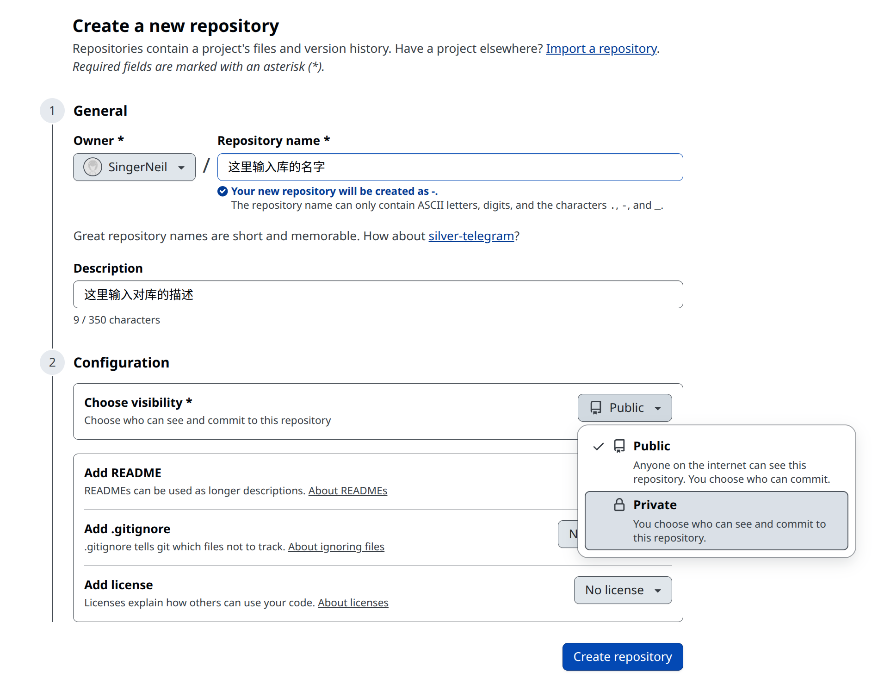
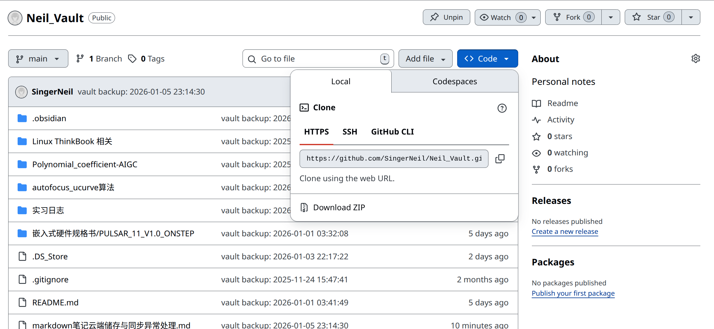

---

# 基于Github的Obsidian库免费同步方案

[B站视频教程](https://www.bilibili.com/video/BV1fZCyBYEuT/?spm_id_from=333.1387.favlist.content.click&vd_source=4a26dae16046c52dd00442733da50418)

---
## 背景

***Obsidian***是本人目前用过最流畅的免费笔记软件，它拥有十分强大的笔记间连接功能和海量的第三方插件库，十分适合个人用户使用。
同时其笔记均以**库的形式**存储在本地，没有对运营方跑路和个人隐私泄露的担忧（反观一些云笔记软件），且在Windows、MacOS、Linux各大发行版、Android、IOS上均有稳定可靠的版本可供使用。

要说其唯一不足便是没有同样免费的笔记云同步服务，***Obsidian***自带的云同步笔记服务需要充值会员才可使用。
但众所周知，GitHub现如今已然成为计算机科学相关产业的基础设施之一。于是本篇笔记，受B站up主**技术爬爬虾**启发，为解决前文提到的困难而给出一种方案——**提供一个基于GitHub的Obsidian云同步方案**。

---
## 下载Obsidian
- 前往[Obsidian官网下载页面](https://obsidian.md/download)下载符合自己操作系统的版本。

---
## 在GitHub上为笔记库建立repository
1. 登录自己的[GitHub](https://github.com/dashboard)账户
2. 创建一个新的repository

	如上图所示输入相应内容，同时若你不希望其他人访问你的库中的内容，需要在`Choose visibility`中选择`Private`。

---
## 将GitHub上创建好的库clone到本地
**PS：若是不会使用命令行可自行询问`LLM`或者使用`GitHub Desktop`，这里仅展示命令行操作方案。**
1. 打开terminal后，先自行使用`cd`命令抵达到你想存放笔记库的根目录下。
2. 复制GitHub上，笔记repository的`HTTPS`地址



3. 在终端内输入以下内容，从而将repository复制到本地（尽管此时的repository还是空库）
```bash
 git clone https://github.com/你的用户名/你的repository名.git
```


---
# Git 冲突处理与手动同步核心手册

## 1. 为什么会产生冲突？

当同时在**多台设备**上对**同一个文件**进行了修改，导致各个设备上Git插件自动执行的pull和push出现冲突，或存在本地修改，但在自动pull前在Github上修改了同个文件的内容，Git 就会因为无法判断保留哪个版本而产生 `Conflict`。

---

## 2. 方案一：无脑以云端为准（放弃本地修改）

```bash
# 1. 获取远程所有分支的最新状态
git fetch --all

# 2. 强制将本地分支重置为远程分支状态
# 注意：这会永久抹掉本地未同步的修改！
git reset --hard origin/main

# 3. 清理掉本地产生的临时冲突文件或未追踪文件
git clean -fd
```

---

## 3. 方案二：手动解决冲突（保留两边内容）

当你发现两台电脑改的内容都有用，需要合并时：

1. **定位冲突**：在 Obsidian 中找到出现 `<<<<<<< HEAD` 标记的文件。
    
2. **编辑文件**：手动删除 Git 的标记符，保留需要的内容：
    /
    - `<<<<<<< HEAD` (本地内容开始)
        
    - `=======` (本地与云端的分隔线)
        
    - `>>>>>>> origin/main` (云端内容结束)
        
3. **完成手动同步三部曲**：
    
    ```bash
    git add .
    git commit -m "Resolve conflict manually"
    git push origin main
    ```
    
---

## 4. 标准手动同步流程

若Giit插件不正常工作（如因网络环境改变导致的Git端口错误），则执行以下步骤。
不过还是***建议先直接重新配置好Git插件和网络端口设置。***

### **A. 开始写笔记前：若自动Git-pull插件没有生效，手动 Pull**

```bash
# 确保本地代码/笔记是全球最新的
git pull origin main
```

### **B. 写完笔记后：若自动Git-push插件没有生效，手动 Push**

```bash
# 1. 暂存所有修改
git add .

# 2. 提交到本地仓库（备注尽量简洁明了）
git commit -m "Update: [你的笔记标题或实习日志]"

# 3. 推送到 GitHub 云端
git push origin main
```

---

## 5. 快速排查命令

- `git status`：查看当前哪些文件在打架。
    
- `git log --oneline`：查看最近几次同步的记录。
    
- `git remote -v`：确认你的云端地址是否正确。
    

---
