# 《纸墨幻城》逐镜头 Prompt 反推与复刻工作流

## 1. 结论先说

这段 31.718 秒的竖屏视频，自动检测到 8 个明显切点，共 9 个独立镜头。画面和运动特征非常支持下面这条工作流：

1. 先建立统一的“宣纸幻城 / 中式志怪”视觉风格。
2. 用生图模型分别生成 9 张竖幅概念图。
3. 每张图作为首帧，单独执行图生视频。
4. 每段只安排一种主运镜和一至两种局部运动。
5. 在剪辑软件里裁成 2–6 秒，以硬切组合；镜头 1 和镜头 9 用前景纸张遮挡完成视觉收束。
6. 最后统一调色、音乐、音效和节奏。

“Seedance 2.0 图生视频”是合理推测，但仅凭导出的成片不能确认具体生成模型。文件元数据只保留了 `Lavf58.76.100` 的后期封装信息，没有生成平台或模型标识。

置信度判断：

- 9 张独立首帧图再做图生视频：高。
- 中段素材先生成 4–5 秒、剪辑时裁成 2–3 秒：高。
- 生图模型一定是 GPT Image 2：中低，Seedream、Midjourney、Flux 等也能做出类似结果。
- 视频模型一定是 Seedance 2.0：中等；运动方式与它相符，但不能从像素反向证明。

## 2. 镜头切分结果

原视频：576×1028、30fps、H.264、AAC，时长 31.718 秒。

| 镜头 | 时间范围 | 成片长度 | 主要内容 |
|---|---:|---:|---|
| 01 | 00:00.000–00:05.067 | 5.067s | 纸山深渊、黑衣队伍、宣纸横卷 |
| 02 | 00:05.067–00:07.000 | 1.933s | 鸟瞰不夜古城、悬空纸带、红色剪纸前景 |
| 03 | 00:07.000–00:09.900 | 2.900s | 水面低机位、倾斜构图、绯红城池倒影 |
| 04 | 00:09.900–00:12.600 | 2.700s | 古卷化作拱桥、提灯行人列队 |
| 05 | 00:12.600–00:15.633 | 3.033s | 牡丹剪纸灯、墙面投影、雾中古城 |
| 06 | 00:15.633–00:18.300 | 2.667s | 纸带牡丹、金箔碎片、发光城门 |
| 07 | 00:18.300–00:21.167 | 2.867s | 巨型镂空纸龙盘旋于古城上空 |
| 08 | 00:21.167–00:25.800 | 4.633s | 长袍人物升向垂落的发光经卷 |
| 09 | 00:25.800–00:31.718 | 5.918s | 纸浪包围的俯瞰幻城、前景卷纸封镜 |

说明：文件夹中同时保存了切点的“精确首帧”和切点后约 0.25 秒的“首个稳定帧”。下面使用稳定帧进行反推，以避开切换瞬间和压缩残影。

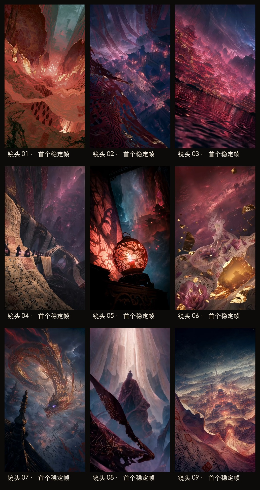

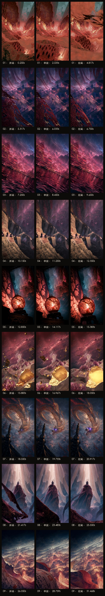

## 3. 全片共同的视觉 DNA

### 3.1 画面核心

- 中式志怪、东方黑暗奇幻、梦境式“纸本世界”。
- 宣纸、古籍残页、朱砂印章、草书墨迹、镂空剪纸、金箔共同构成建筑、道路、云层和生物。
- 唐宋式重檐古城，但不是写实古装片，而是巨型手工纸艺装置与电影概念设计的结合。
- 人物多为无面孔的小型黑衣剪影，强调世界尺度，不强调角色表演。
- 画面通常有一个极近的纸张或剪纸前景、一个主体中景和深远的古城背景，方便图生视频制造视差。

### 3.2 色彩与光线

- 主色：赭红、胭脂红、暗紫、墨黑、靛青。
- 辅色：冷青雾气、暖金灯火、少量金箔高光。
- 光源常藏在纸张后方，形成半透明宣纸、剪纸投影和体积光。
- 高反差、暗部厚重、灯火密集，但高光不应变成现代霓虹。

### 3.3 镜头习惯

- 9:16 竖构图。
- 20–28mm 感的超广角纵深，偶尔使用明显荷兰角。
- 主运镜很克制：慢推、轻微横移或锁定镜头。
- 真正的动态主要来自纸带、雾、灯火、金箔、流水和衣摆。
- 镜头 1、6、8、9 都安排了掠过镜头的近景物体，既增强空间感，也能掩盖生成瑕疵。

## 4. 生图模型共享风格 Prompt

下面这段作为 9 张图共同的前缀。每个镜头的专属内容接在它后面。

```text
创作一张 9:16 竖幅的中式志怪奇幻电影概念画。一个由宣纸、古籍残页、朱砂印章、金箔、镂空剪纸和浓墨共同构成的虚妄古城世界；建筑、道路、山川和云层看似真实宏伟，又能清楚看见层层卷曲的纸纤维、手工撕边、褶皱和墨迹。唐宋式重檐楼阁与巨型纸艺装置融合，东方黑暗奇幻，肃穆、诡谲、空灵，具有巨大的尺度反差。

主色为赭红、胭脂红、暗紫、靛青和墨黑，辅以冷青天光、暖金灯火和少量金箔高光。潮湿雾气、体积光、漂浮尘屑，电影级高对比照明，深远透视，明确的前景、中景、远景，精细纸纤维和手工剪纸细节。画面中的书法只作为不可辨读的古老墨迹纹理，不出现现代文字。

保持中式古典建筑逻辑；不要现代物件，不要西式建筑，不要卡通感，不要平面海报感，不要塑料材质，不要水印、字幕、边框和品牌标识。
```

建议先生成镜头 02、05、09，把其中最满意的三张组成风格参考板。之后生成其他镜头时同时上传参考板，要求只继承材质、色调和世界观，不复制构图。

## 5. 逐镜头反推

---

### 镜头 01｜纸山深渊与黑衣队伍

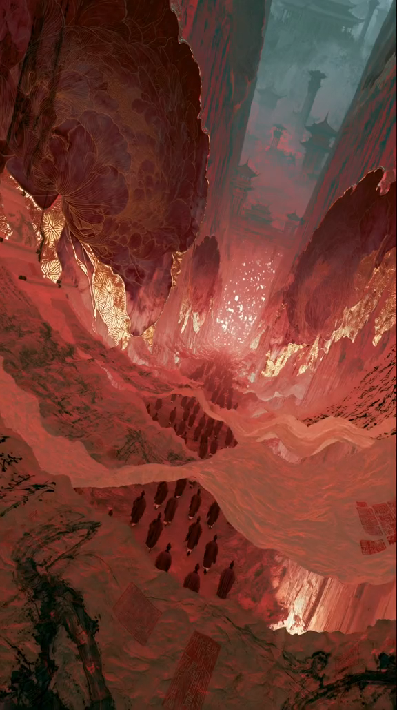

**静态画面分析**

- 极端纵深的宣纸峡谷，画面整体带轻微倾斜。
- 巨型卷曲纸层和牡丹状纸艺悬在上方，中央裂隙透出灼热金红光。
- 两列小型黑衣人物沿纸带道路走向深处。
- 右侧横跨画面的宣纸卷是后续遮镜运动的关键预埋。

**生图专属 Prompt**

```text
在共享风格基础上：从高处俯视一座由无数巨型宣纸卷和古画残页形成的深渊峡谷。卷曲纸层像山脉与浪潮交叠，左上方悬着巨大的暗红牡丹状纸艺结构，中央深渊裂隙透出耀眼而神秘的暖金红光，远处隐约出现古塔剪影。两列身披黑色古袍、没有清晰面孔的小人物沿着悬空纸带道路走向深处。近景右侧有一条宽大的半透明宣纸横卷，带朱砂印章和淡墨山水，预留向镜头掠过的空间。超广角，高机位，强烈纵深，画面微微倾斜，宏大而压迫。
```

**Seedance 2.0 图生视频 Prompt**

```text
以 @图片1 为首帧，保持原始构图、人物数量、纸山结构和中式纸艺材质不变。镜头近乎锁定，只做极轻微的缓慢前推。两列黑衣人以很慢的速度向峡谷深处行走，步幅小而整齐，衣摆轻轻摆动。宣纸峡谷像呼吸一样微弱起伏，远处雾气和细小火星缓慢上升，中央金红光轻微明灭。

最后 1.2 秒，右侧近景的大幅宣纸被气流掀起，从右下方快速而自然地向左上方掠过镜头，形成强烈视差并短暂遮满画面，作为纸张擦镜转场。纸张保持真实柔软的纤维和重量感，不要让建筑、人物或纸张纹理融化变形，不新增人物和物体。竖屏电影镜头，约 5 秒。
```

---

### 镜头 02｜悬纸之下的鸟瞰不夜城

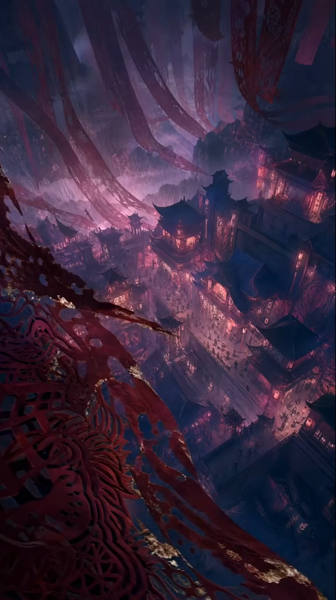

**静态画面分析**

- 高空俯瞰层叠古城，街道和窗户充满胭脂红灯火。
- 巨型长纸带像天幕一样从上方垂下。
- 左下近景是红蓝金色的镂空剪纸或织物，形成强烈视差层。

**生图专属 Prompt**

```text
在共享风格基础上：高空俯瞰一座拥挤、层层向下延伸的唐宋式不夜古城，深色重檐楼阁沿狭窄街巷密集排列，成千暖红灯火在冷青雾气中发亮，街道上有细小人群。天空并非真实天空，而是许多巨大的旧宣纸长卷从高处垂落，纸面有暗红墨迹和破损边缘。左下近景放置一大片红、靛蓝与残金构成的镂空纸雕纹样，边缘清晰，像悬在城池上方的帷幕。高机位、超广角、斜向纵深，冷青与绯红对比，宏伟、神秘、繁华又不真实。
```

**Seedance 2.0 图生视频 Prompt**

```text
以 @图片1 为首帧，完整保持古城布局、楼阁轮廓、色彩和左下剪纸前景。镜头从高空非常缓慢地向城中心推进并轻微下降，运动幅度小，产生清楚但克制的前中后景视差。左下红色剪纸边缘被高空微风轻轻掀动，上方悬垂的长纸带缓慢摆动；城内灯火自然闪烁，街道上的微小人群缓慢流动，冷雾沿屋顶穿行。不要快速俯冲，不要旋转镜头，不要改变建筑结构，不要让纸带粘连或融化。生成 4 秒，剪辑时取其中最稳定的约 2 秒。
```

---

### 镜头 03｜水面低机位的绯红幻城

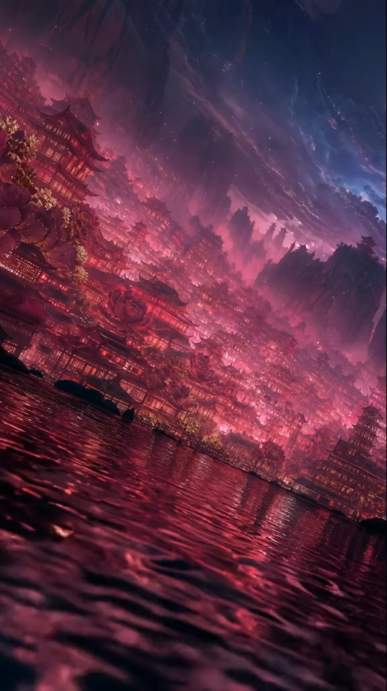

**静态画面分析**

- 镜头几乎贴近水面，水面占据下半部。
- 整座古城沿岸向远方层叠，画面有明显荷兰角。
- 红紫城光倒映在黑色水面，天空是流动墨云与纸层。

**生图专属 Prompt**

```text
在共享风格基础上：将镜头贴近一片黑色水面，使用明显但优雅的荷兰角。远岸是一座无限层叠的绯红古城，密集唐宋楼阁沿山势向远方延伸，窗灯和街火形成成千细小暖光，屋顶之间生长巨大的暗红纸牡丹。天空由靛青墨云、薄雾和半透明纸层构成，远山与塔楼变成剪影。近景水面具有真实细密波纹，映出拉长的红紫灯光。超广角、低机位、画面倾斜，浪漫而危险的志怪夜景。
```

**Seedance 2.0 图生视频 Prompt**

```text
以 @图片1 为首帧，保持倾斜角度和城市轮廓不变。低机位镜头基本锁定，只做几乎察觉不到的横向滑动。水面的小波纹持续向镜头扩散，红紫倒影随波纹柔和破碎并重新聚合；远处窗灯不规则地轻微闪烁，薄雾从城楼之间缓慢横移，天空墨云极慢流动。不要产生大浪，不要改变水平倾斜角度，不要让楼阁漂移或增生，不要出现船只或新增人物。约 4 秒，剪辑保留 2.9 秒。
```

---

### 镜头 04｜古卷化桥与提灯行列

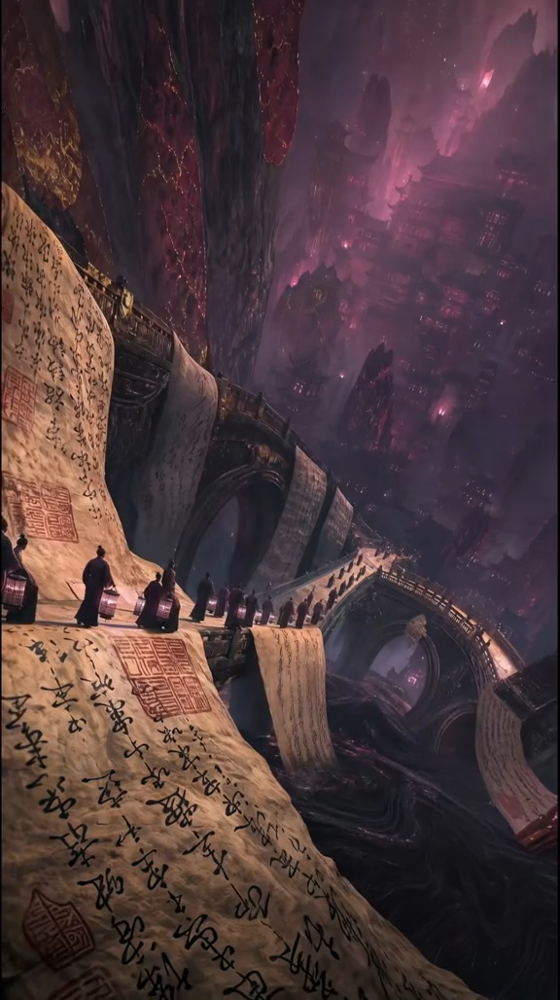

**静态画面分析**

- 古籍长卷直接变成道路和桥面，跨过一组巨大拱桥。
- 黑衣行人提着方形纸灯笼，沿曲线路径走向远处。
- 下方是浓墨般的黑色深渊，背景古城被红紫雾吞没。

**生图专属 Prompt**

```text
在共享风格基础上：一条铺满草书墨迹、朱砂方印和褶皱的巨型古籍长卷化作悬空道路，蜿蜒跨过多层宏伟石质拱桥；桥下不是河流，而是缓慢翻涌的浓黑墨海。十几名身披黑袍的无面行人排成一列，手提方形暖光纸灯笼，沿卷轴道路走向雾中的远方。巨大卷纸从桥栏垂下，背景是被暗红与紫色雾气吞没的高耸古城。斜向构图，低到中等机位，纸路占据强烈前景，引导线通向画面深处。
```

**Seedance 2.0 图生视频 Prompt**

```text
以 @图片1 为首帧，保持拱桥、卷轴道路和行人队列的位置关系不变。镜头沿卷轴道路非常缓慢地向前推进，像跟随队伍进入雾城。黑衣人以缓慢一致的速度向前行走，灯笼随步伐轻微摇摆，暖光自然呼吸；垂落的纸页边缘被风轻轻掀动，纸面墨迹和印章保持固定，不游走。桥下黑墨只做低频缓慢翻涌，远处红紫雾横向穿过建筑。不要让人物回头，不出现可见面孔，不改变桥梁结构，不让文字变成现代可读文字。约 4 秒，剪辑保留 2.7 秒。
```

---

### 镜头 05｜牡丹剪纸灯与影城

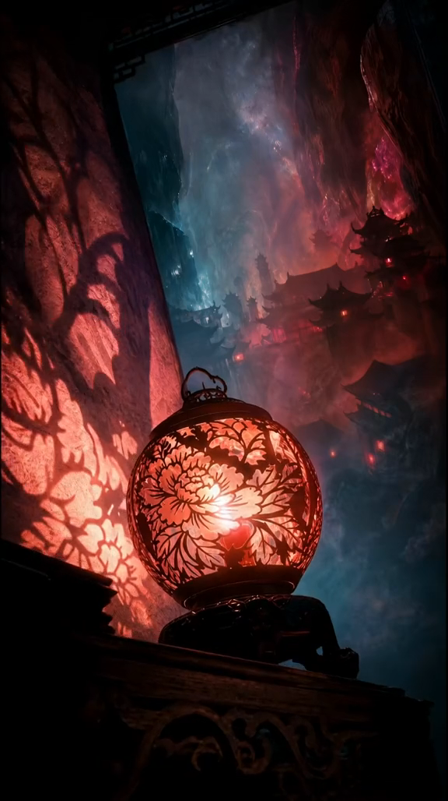

**静态画面分析**

- 圆形牡丹剪纸灯是唯一明确近景主体。
- 灯光在左侧宣纸墙投下放大的花影。
- 背景门洞外是冷青雾气中的暗红古城，形成暖近景、冷远景。

**生图专属 Prompt**

```text
在共享风格基础上：室内暗处的古木案几上放置一盏精致的圆形牡丹镂空剪纸灯，黑色金属骨架和细密牡丹花瓣剪影包围暖红灯芯。灯光在左侧巨幅宣纸墙上投下放大的花枝剪影。门洞外是冷青雾气和深红灯火笼罩的重檐古城，楼阁只显现局部轮廓。近景几乎纯黑，中景灯笼暖红明亮，远景冷青幽深，低机位仰拍，浅到中等景深，安静、神秘、具有祭祀感。
```

**Seedance 2.0 图生视频 Prompt**

```text
以 @图片1 为首帧，保持灯笼花纹、案几和背景楼阁不变。镜头缓慢向右横移并轻微推近灯笼，产生细微背景视差。灯芯亮度像呼吸一样柔和起伏，牡丹剪纸投影在宣纸墙上随火光轻轻摇曳，但花纹结构必须保持稳定；门外冷雾缓慢流过楼阁，远处几盏红灯轻微闪烁。不要让灯笼旋转，不要让牡丹图案重绘或变形，不新增人物。约 4 秒，剪辑保留 3 秒。
```

---

### 镜头 06｜纸牡丹与漂浮金箔

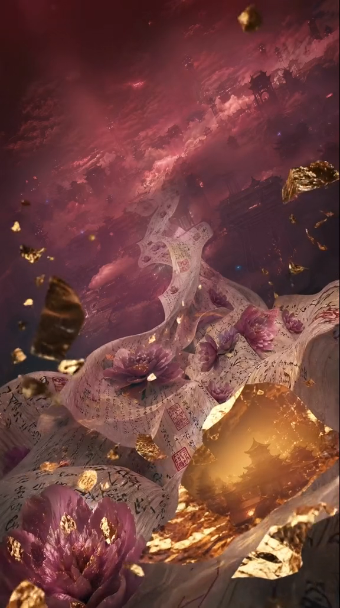

**静态画面分析**

- 巨幅书法纸带像河流一样卷曲，长出暗粉牡丹。
- 金箔碎片悬浮于不同景深，其中一片像发光窗口，内部隐约有城池。
- 非常适合用粒子和近景遮挡增强图生视频立体感。

**生图专属 Prompt**

```text
在共享风格基础上：许多写满古老墨迹和朱砂印章的宣纸长卷像河流与花瓣一样在空中盘旋，纸带之间盛开数朵暗粉和胭脂色牡丹。大量不规则金箔碎片悬浮在不同距离，部分虚化掠过近景。画面中央偏下有一片较大的半透明金箔，内部像窗口一样映出一座被金光照亮的微缩古城。背景是暗红云海和隐约楼阁。微距与超现实广角结合，强烈前后景层次，金箔暖光与紫红雾气交织，华丽但阴郁。
```

**Seedance 2.0 图生视频 Prompt**

```text
以 @图片1 为首帧，保持牡丹、纸带和中央发光金箔窗口的形状与位置基本不变。镜头缓慢向中央金色窗口推进。宣纸带在气流中柔软起伏，牡丹花瓣只做非常轻微的自然颤动，不开放、不变形。大小不同的金箔碎片从远处缓慢漂向镜头并旋转，形成明显景深；其中一两片近景金箔从画面下方和右侧掠过，短暂遮挡局部画面。中央金光逐渐增强，内部古城保持稳定。不要生成爆炸，不要让金箔液化，不要改变花朵数量。约 4 秒，剪辑保留 2.7 秒。
```

---

### 镜头 07｜镂空纸龙临城

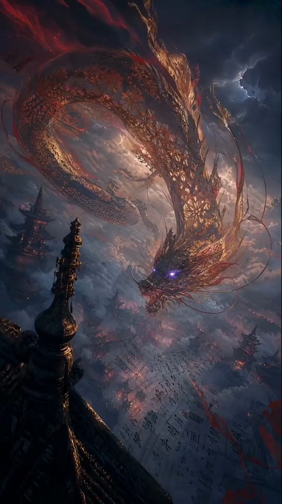

**静态画面分析**

- 巨龙身体像镂空金属剪纸与燃烧纸纤维的混合体。
- 龙身盘成接近圆环，头部从右上方向画面中心俯冲。
- 紫色眼光是全片少见的冷色高亮。
- 左下古塔作为近景标尺，使巨龙显得极其巨大。

**生图专属 Prompt**

```text
在共享风格基础上：一条体型覆盖天空的东方巨龙盘旋在纸墨古城上方，身体形成巨大的环形弧线。龙并非血肉，而由暗金与暗红的镂空剪纸、纤细纸纤维、残金边缘和少量燃烧般的红色流苏构成，内部可以透见暴风云和闪电。龙首从右上方俯向画面中心，双眼发出克制而锐利的紫光，龙须细长飘动。左下近景是一座黑色高塔尖顶，远处是雾中无数古塔与写满墨迹的纸地面。低机位仰拍、超广角、史诗尺度、暴风雨天空。
```

**Seedance 2.0 图生视频 Prompt**

```text
以 @图片1 为首帧，严格保持东方龙的镂空剪纸结构、盘旋方向、古塔和城市布局。龙的长身体以缓慢、有重量的波浪动作在云中游动，龙首逐渐下降并稍微靠近镜头，龙须和红色纸纤维随风摆动，紫色双眼亮度轻微增强。镜头做极慢的向前推进并轻微向上调整以跟随龙首；背景暴风云缓慢翻涌，远处闪电只短暂照亮云层，不直击城市。避免蛇形乱扭，避免多头、多爪、断裂肢体和脸部变形，不改变龙的基本轮廓。约 4 秒，剪辑保留 2.9 秒。
```

---

### 镜头 08｜人物升入垂落经卷

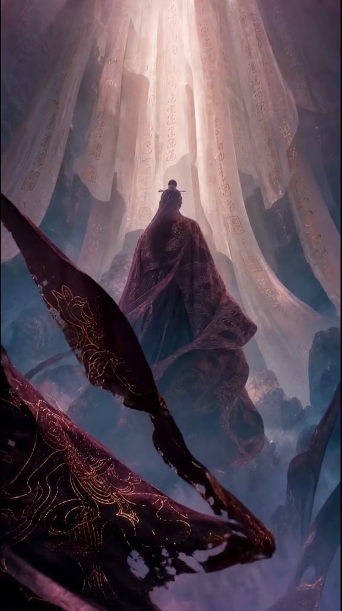

**静态画面分析**

- 背对镜头的长袍人物悬浮于中央，没有面部细节。
- 顶部数十幅白色经卷垂落，强光从卷轴间隙照下。
- 暗红纸带从左下近景斜穿画面，为升腾运动提供视差。

**生图专属 Prompt**

```text
在共享风格基础上：一名背对镜头、没有可见面孔的古代人物悬浮在深谷中央，穿深胭脂与墨青色层叠长袍，宽大衣摆和长长披帛向下拖曳，袍面只有克制的暗金刺绣。上方垂落数十幅巨大的半透明白色经卷与宣纸幔帐，纸面布满浅淡古老墨迹和朱砂小印，一束洁白偏暖的天光从纸卷之间直落下来。左下与下方近景有深红镂空纸带斜穿画面，背景是蓝灰雾气和若隐若现的纸山。低机位仰拍，中心对称，神圣与诡异并存。
```

**Seedance 2.0 图生视频 Prompt**

```text
以 @图片1 为首帧，保持人物始终背对镜头，不出现脸部。人物以缓慢、平稳、具有重量感的速度向上升入光束，身体姿态稳定；多层长袍、披帛和发带在上升气流中向下舒展并柔和摆动。镜头缓慢向前并轻微向上抬升，持续跟随人物。上方白色经卷缓慢垂荡，光束中的微尘向上漂浮；近景暗红纸带从左向右柔和摆过，产生清楚视差但不完全遮住人物。不要让人物转身，不要新增手臂，不要改变服装纹样，不要让经卷文字游动。约 5 秒。
```

---

### 镜头 09｜纸浪包围的终局幻城

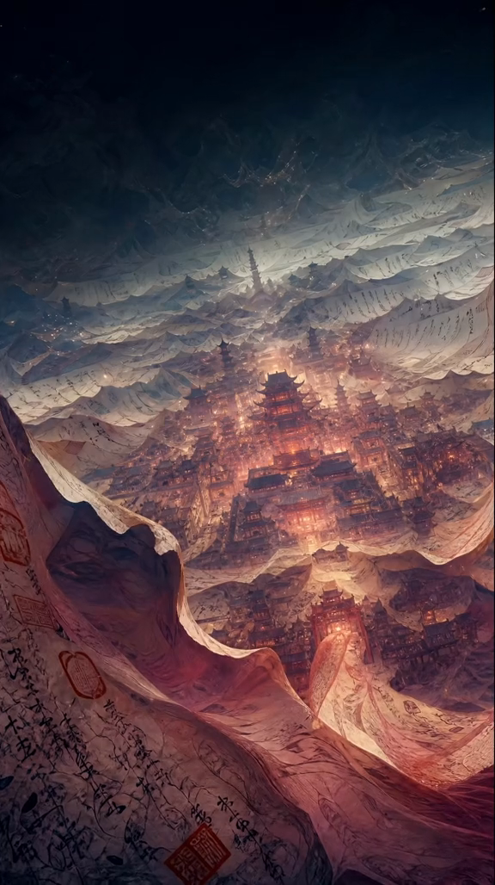

**静态画面分析**

- 高空俯瞰暖金古城，层层纸浪像山脉和云海一样包围城市。
- 城市中心轴清楚，中央主塔最亮。
- 左下和下方是巨大的红白书法纸卷，后续会抬升并覆盖镜头。
- 这张图兼具“世界全景”和“最终揭示”，适合作为结尾。

**生图专属 Prompt**

```text
在共享风格基础上：从极高处俯瞰一座坐落在巨大纸质盆地中的完整古城，城市沿中轴线层层展开，中央主塔最高最亮，数以千计的暖金灯火形成细密街道。四周无尽山脉、云海和波浪全部由重叠的白色古籍纸页构成，纸页写有不可辨读的淡墨书法和朱砂小印。左下与下方近景是一幅巨大、褶皱、卷曲的红白宣纸，像浪头一样向镜头翻卷；远处纸山逐渐没入深蓝黑夜。超广角、高空俯瞰、中心纵深、史诗终局感，暖城与冷暗天空形成强烈对比。
```

**Seedance 2.0 图生视频 Prompt**

```text
以 @图片1 为首帧，严格保持城市中轴线、中央主塔和环形纸山结构。镜头从高空非常缓慢地向城市中心推进并轻微下降，城市灯火逐层显现，远处纸山像潮汐一样低频起伏，薄雾沿城池边缘流动。近景红白宣纸先缓慢翻涌，最后 1.5 秒被气流掀起并从下方向上卷过镜头，越来越靠近镜头，纸纤维和朱砂印章清楚可见，最终遮住大部分城市，形成纸张封镜。不要让城市塌陷或重建，不要快速俯冲，不要让纸张变成液体，不出现现代文字。约 6 秒。
```

## 6. 更接近原片的实际制作步骤

### 步骤 A｜建立风格参考板

1. 先用共享 Prompt 生成镜头 02、05、09。
2. 三张图分别负责：
   - 镜头 02：古城建筑、红蓝色调和高空尺度。
   - 镜头 05：剪纸、宣纸透光和近景材质。
   - 镜头 09：纸浪世界观与终局城市全景。
3. 选出风格一致的三张图，拼成一张 3 宫格参考板。
4. 后面六张图始终带上这张参考板，并写明“只参考材质、配色和世界观，不复制原构图”。

### 步骤 B｜生成每个镜头的首帧

每次只生成一个镜头。建议提示词结构：

```text
共享风格 Prompt
+ 镜头专属场景 Prompt
+ 构图与机位
+ 必须保留的近景遮挡物
+ 不要出现的内容
```

先把首帧做对，再进入视频生成。不要期望 Seedance 在运动阶段重新设计复杂建筑或修正错误构图。

生成首帧时尤其要保留三层空间：

- 极近景：纸带、金箔、塔尖、灯笼。
- 中景：人物、龙、桥、主城。
- 远景：雾、纸山、层叠楼阁。

图生视频之所以有电影感，很大部分来自这三层之间的视差，而不是复杂运镜。

### 步骤 C｜Seedance 2.0 图生视频

最稳的写法是：

```text
保持什么不变
+ 镜头只做一种主运动
+ 主体做一种清晰动作
+ 环境做一到两种次级运动
+ 最后是否需要遮镜
+ 明确禁止形变和新增物体
```

不要在同一条 Prompt 里同时要求环绕、俯冲、旋转、变焦和高速跟随。原片大多数镜头接近锁定或慢推，动态主要来自纸、雾、灯火和衣摆。

如果 Seedance 2.0 界面支持多模态引用，复刻时可采用：

```text
@图片1 作为首帧和唯一美术、人物、构图参考。
@视频1 只参考镜头运动、纸张摆动速度和动作节奏，不继承其中的角色、建筑、色彩、文字或其他画面内容。
```

其中 `@视频1` 可以直接使用原片对应的单个镜头，而不是整段 31 秒视频。这样比单靠文字描述运镜更接近。

### 步骤 D｜时长与剪辑

- 镜头 01：生成 5 秒，基本完整使用。
- 镜头 02–07：每段生成约 4 秒，剪辑时只取最稳定的 2–3 秒。
- 镜头 08：生成 5 秒，完整保留升腾过程。
- 镜头 09：生成 6 秒，保留结尾纸张封镜。
- 镜头之间以硬切为主，不要给所有镜头套溶解转场。
- 镜头 01 的纸张擦镜不一定要直接接镜头 02，可在纸张遮满前后选一帧硬切。
- 先剪视觉节奏，再统一添加音乐和音效；不要依赖九段分别生成的原生音频保持一致。

### 步骤 E｜统一后期

- 全片统一暗部偏蓝黑、高光偏胭脂红和暖金。
- 对所有镜头应用相同强度的轻微颗粒、暗角和柔和辉光。
- 控制红色饱和度，防止压缩后变成荧光品红。
- 可加入非常轻的纸张摩擦、风声、远处铃声、低频轰鸣和水声。
- 最终竖屏导出时再做一次锐化，避免在生成阶段过度锐化纸纤维。

## 7. 一条可直接用于 Seedance 多模态参考的总指令

如果你已经把九张首帧和九个对应原镜头裁好，可以对每个镜头复用下面的总模板：

```text
@图片1 是本镜头的首帧与唯一美术参考，严格保持其主体身份、古城布局、宣纸与剪纸材质、红蓝金配色、光线方向和竖屏构图。@视频1 仅参考镜头运动、主体动作的时间节奏、纸张和雾气的运动方式，不复制 @视频1 的人物、建筑、文字、颜色和画面内容。

生成一个中式志怪、东方黑暗奇幻的电影镜头。主运动按照本镜头专属指令执行，运镜克制平稳，真实前中后景视差，纸张具有纤维、重量和柔软度，雾气与灯火自然变化。保持建筑稳定，保持人物数量，保持装饰纹样，避免融化、增生、结构漂移、现代物件、字幕、水印、可读现代文字和无关新增元素。
```

再把本报告对应镜头的 Seedance 专属 Prompt 接在后面即可。

## 8. 最关键的复刻建议

这条片子的核心并不是“一个特别长的神级 Prompt”，而是四个很稳的选择：

1. 用统一风格板锁定宣纸、朱砂、剪纸、古城和红蓝金配色。
2. 每个镜头先做一张足够完整的概念图。
3. 视频阶段只让一种主动作发生，建筑和构图尽量不动。
4. 用近景纸张、雾、金箔和衣摆制造纵深，并利用遮挡隐藏模型瑕疵。

只要首帧质量足够高，即使 Seedance Prompt 比本报告中的版本更短，也可能得到接近原片的效果；反过来，如果首帧的层次、材质和构图不对，再长的视频 Prompt 也很难补救。
