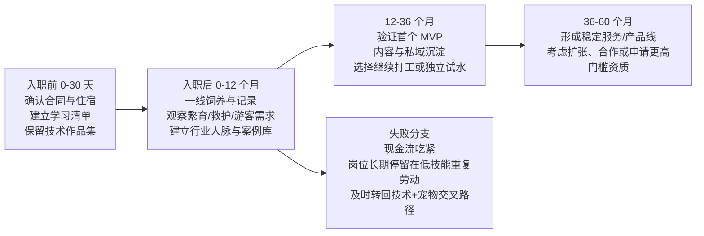

# 从裸辞去鸟舍到在中国做宠物鹦鹉创业

## 执行摘要

这不是一份“你该不该追梦”的鸡汤报告，而是一份更冷一点、也更诚实一点的判断：以你目前的背景来看，去“千鹦鸟舍”做饲养员，不是一个常规意义上更优的就业选择，却可能是一个对未来创业更优的“学徒型投资”。它的价值不在于岗位头衔，而在于你能否在一个同时覆盖繁育、科普、文旅、救助与潜在医疗协同的场域里，把一年体力劳动，转化成未来创业真正需要的稀缺资产：物种级饲养知识、疾病早期识别能力、合规意识、供应链认知、客户教育能力，以及最难被复制的一线判断力。千鹦鸟舍的公开资料显示，其项目位于缙云仙都，环评批复总投资约 1 亿元、总用地约 5.97 万平方米，园区被规划为观赏、科研科普、休闲、彩鹦谷、林池景区等多个功能区；官方与企业公开口径又显示，它已经从 2023 年开始对外开放部分区域，兼具鹦鹉主题乐园、生物多样性科普与野生动物救护等功能，并在近年被列入省级生物多样性体验地、创建国家 3A 景区。也就是说，你去的不是一个单一鸟店，而是一个更接近“鸟类产业综合体”的学习现场。citeturn6view0turn37search2turn5search0turn5search26

但这条路的前提，是你必须先看清一个事实：在中国做宠物鹦鹉创业，最大的门槛不是流量，不是审美，不是拍视频好不好看，而是**合法性、动物福利与标准化能力**。国家林草局 2021 年关于人工繁育鹦鹉的复函明确指出，除桃脸牡丹鹦鹉、虎皮鹦鹉、鸡尾鹦鹉外，从境外引进的 CITES 附录所列鹦鹉种类均按国家重点保护野生动物管理；同时对费氏牡丹、紫腹吸蜜、绿颊锥尾、和尚鹦鹉四种开展专用标识试点。近年的省级林业主管部门公开政策解读与答复也基本沿着这一框架运行：前三种可按非保护类管理，四种试点可凭标识作为宠物依法购买，除此之外的大部分鹦鹉人工繁育、出售、购买、利用都要落到许可与标识体系里。现行《野生动物保护法》又明确规定，人工繁育国家重点保护野生动物要取得省级批准，出售、购买、利用相关动物及其制品需要批准和专用标识，出售时还应依法附有检疫证明，跨县运输也要持证并附检疫证明。换句话说，未来如果你创业，最危险的幻觉就是“先繁育几对热门鹦鹉，再起号卖鸟”。这条路在中国不是最低门槛路径，恰恰是最容易踩线的一条路。citeturn38view0turn39view0turn10view1turn12search1

从现金流角度看，你这次跳转的机会成本也非常真实。公开招聘中，类似“鹦鹉助理饲养员”岗位的月薪常见区间大约在 3000—5000 元，而且职责包括日常饲养、笼舍清洁与消毒、繁育管理、状态观察、环境控制、库存管理和生物安全记录，并明确要求能接受驻场、轮班和节假日工作。相比之下，麦可思研究院发布的《2025 年中国本科生就业报告》相关公开转引数据显示，2024 届本科毕业生毕业半年后的平均月收入为 6199 元，而互联网开发人员的月收入约为 8245 元，软件开发人员约为 7528 元。对一个计算机本科应届生而言，这意味着你在主动放弃一条更易解释、通常也更高薪的起步路径。若你的真实到手薪酬接近同类饲养员岗位，你每个月放弃的现金流，很可能是几千元级别。这个代价，不能靠“热爱”四个字抹平。citeturn19search1turn35search2turn36search2

所以，我对你当下决策的核心判断是：**短期看，它是高风险职业切换；中期看，它有机会成为高价值行业学徒；长期看，它只有在你不把自己训练成“更熟练的打工人”，而是训练成“更有创业资产的行业内行”时，才是值得的。**如果你只是去喂鸟、打扫、接待游客、熬时间，那么一年后你会很辛苦，但未必更接近创业。如果你把这一年拆成“物种知识、繁育流程、疾病识别、客户需求、法律边界、供应链与内容表达”六块资产来刻意积累，那么这次裸辞才有成为未来创业跳板的可能。基于市场、监管和你的背景，我更推荐你最终的创业方向先从**合法鸟种服务、寄养与教育、内容与电商、或者面向鸟舍的数字化工具**切入，而不是直接走活体繁育销售。这个判断，既来自行业增长与鸟类细分需求的存在，也来自当前合规边界与监管执行的现实。citeturn26search1turn26search0turn23search1turn18search0

## 研究边界与关键假设

这份报告基于三类资料。第一类，是政府公开文件与官方口径，包括《野生动物保护法》、国家林草局关于鹦鹉管理的复函、省级林业部门对宠物鹦鹉合法范围的政策解读，以及千鹦鸟舍项目所在地方政府的规划、环评与文旅资料。第二类，是企业与平台公开资料，包括千鹦鸟舍相关招聘与项目介绍、上海园林集团披露的 EPC 项目信息、携程等旅游平台的游客点评，以及波奇、多宠、小佩等公开产品页面。第三类，是学术研究与行业报告，包括关于宠物行业规模、鹦鹉福利、宠物寄养商业模式、鸟类行为识别等论文和报告。需要特别说明的是：我没有拿到你的劳动合同、工资条、社保方案、住宿安排，也没有对千鹦鸟舍内部员工做可验证访谈；因此，凡涉及你岗位的实际薪酬、内部晋升、离职率、管理风格以及浙江本地审批口径的部分，都必须保留不确定性。citeturn10view1turn38view0turn39view0turn6view0turn18search0

为了把这种不确定性说透，我建议你把自己的现实条件先放进下面这个假设框架里看：

| 未指定项 | 偏紧假设 | 中性假设 | 偏松假设 | 对结论的影响 |
|---|---|---|---|---|
| 现金储备 | 少于 6 个月生活费 | 6—12 个月生活费 | 超过 12 个月生活费 | 决定你能否把“学徒期”真正熬成资产积累期 |
| 家庭/伴侣支持 | 基本无支持 | 可承担部分波动 | 可兜底重大风险 | 决定你能否承受低薪和搬迁带来的摩擦 |
| 合同与住宿 | 不包住、低底薪、试用期长 | 薪资一般、住宿可协商 | 包住包餐、节奏稳定 | 直接决定这次切换的现金消耗速度 |
| 体力劳动接受度 | 不愿长期一线体力工作 | 可接受一年左右 | 愿意长期深耕一线 | 决定你适不适合走繁育/寄养重运营路线 |
| 能否做副业与内容 | 完全不允许 | 可低调做个人记录 | 公司默许或支持科普表达 | 决定你能否同步搭建未来客户资产 |

如果你的情况更接近“偏紧假设”，这次选择就不能被包装成浪漫的行业转身，而必须被当作一场带期限的创业预科；如果你的情况更接近“偏松假设”，你就有条件用一年时间换来对这个行业的深度进入券。这里最关键的，不是你现在有没有钱，而是你能不能在钱开始紧张之前，拿到**足以支撑二次选择的可迁移资产**。这也是后文所有路径建议的出发点。  

## 纵向分析

### 决定发生之前

你这次裸辞，看起来像是从“计算机本科生”转向“鹦鹉饲养员”，但它真正发生的地方，其实是在两条人生曲线的交叉点上：一条是更社会化、更标准、更容易被家人和招聘平台理解的技术就业路径；另一条是更窄、更难、更脏、更慢，却可能更接近你想自己开业的行业学徒路径。对于一个计算机本科应届生，这种转向之所以显得“逆行”，是因为技术岗的社会共识更强，起薪也普遍更高。公开数据显示，2024 届本科毕业生半年后平均月收入约为 6199 元，而互联网开发人员的月收入在 8245 元左右；和这一数字相比，公开招聘中的鹦鹉助理饲养员岗位明显更低薪、更辛苦、更依赖体力和耐心。也正因此，你这一步如果要成立，它的理由就不能是“我不想上班了”，而只能是“我愿意用更低的短期回报，买一个别处买不到的行业进入权”。citeturn35search2turn36search2turn19search1

问题在于，宠物鹦鹉行业并不是一个靠“喜欢鸟”就能进去并做成的行业。它在中国有几个非常硬的现实：第一，合法可操作的物种范围，比很多入门者想象得窄得多；第二，鹦鹉不是低维护宠物，学术研究一再提醒，陪伴鹦鹉在福利上会遇到行为异常、环境剥夺、飞行和社交行为受限等一系列问题；第三，行业里最值钱的 know-how 不是搜索得到的百科，而是你在繁育、喂养、观察、隔离、救护、客户沟通中形成的“身体化知识”。如果你未来想创业，这些知识靠读帖子永远不够，必须上手。也正因为如此，你选择先去鸟舍打一段“看上去不体面”的基础工，本身并不荒唐；荒唐的是，如果你意识不到这套行业入场券其实非常昂贵。citeturn39view0turn10view1turn21search0turn21search2turn29search1

从千鹦鸟舍公开信息看，它恰好是一个适合做这种“昂贵学徒”的地方。公开规划与企业介绍显示，这一项目并非普通花鸟市场摊位，而是集鹦鹉繁育、科研科普、生物多样性教育、林地体验、野生动物救助于一体的综合性园区，部分区域自 2023 年 10 月起试运营，至 2024 年 7 月已累计接待近 13 万人次。地方规划又对其赋予了带动客流、形成林业经济新业态的期待。换句话说，千鹦鸟舍的特殊性在于：你去那里，不仅能看到鸟，还能看到“鸟如何被转化成一个完整的消费与教育场景”。这对未来创业者来说，是非常重要的一课。因为很多人只看到了活体和配对，没看到科普、动线、互动、信任和讲述。citeturn6view0turn37search2turn4search27turn5search24

### 入职前的这一个月

真正的分水岭，不是你下个月去不去报到，而是你在报到前这一段时间，准备的是“新工作”还是“新行业”。如果你只是在等入职，那么你大概率会像普通新员工一样，被岗位安排推着走；如果你从现在开始就把未来一年定义成“行业田野调查 + 创业预备役”，很多东西会完全不同。

首先，你要把工作本身去浪漫化。类似岗位的公开职责已经把现实写得很清楚：清洁笼舍、环境消毒、观察食欲与粪便、管温湿度与光照、盯库存、做记录、执行生物安全措施，还要接受节假日轮班与驻场。所谓“每天和可爱的鹦鹉在一起”，在真实的一线场景里，往往先表现为每天与鸟粮、粪便、粉尘、消毒、早晚班和突发状况打交道。再结合宠物鸟人畜共患病研究的提醒，你还要把职业卫生当成很现实的事情：口罩、手套、工作服隔离、个人清洁习惯、呼吸道和皮肤暴露管理，都不是小题大做。你不是去坐办公室，你是在进入一个有活体、有粉尘、有病原传播可能性的工作场景。citeturn19search1turn29search0

其次，你要在入职前把自己未来想学的东西写成“清单”，而不是把成长交给运气。我建议你把一年目标拆成六条线：一条是**物种线**，至少把合法常见鸟种和常见贸易种的学名、习性、繁育周期、常见问题梳理清楚；一条是**流程线**，观察从配对、产蛋、孵化、育雏、断奶到出售或展示的完整链路；一条是**健康线**，学习如何从粪便、食欲、站姿、羽毛状态、呼吸声、互动性这些一线信号里发现异常；一条是**合规线**，把许可证、专用标识、检疫、运输边界和网络交易风险搞清楚；一条是**供应链线**，了解饲料、保健品、笼具、脚环、标识等物料如何采购、如何定价；最后一条是**客户线**，观察游客、潜在宠主和真正养鸟人最频繁问什么、最容易误判什么、最愿意为什么付钱。公开法规和公开市场都在告诉你：未来真正值钱的创业者，不是最会夸鸟可爱的那个人，而是最知道边界在哪里、问题会出在哪、客户为什么不放心的那个人。citeturn38view0turn10view1turn23search1turn21search0

再次，你要做一个对你很重要、但很多人不会做的动作：**保留技术身份**。你本来是计算机本科出身，这不是过去式，而是你在行业里最可能形成差异化的武器。学界已经证明，通过深度学习和多视角系统，对鸟类进行自动计数、识别和行为跟踪在技术上是可行的。把这个能力硬套到创业里，未必马上能赚钱；但把它用在寄养可视化、个体档案、异常行为提醒、客户日报、谱系与繁育记录、库存与标识管理上，是完全有现实想象力的。你现在最不该做的，是因为去做饲养员，就把自己的技术背景扔掉。你应该做的是，带着技术背景去做饲养员。citeturn30academia47turn34academia49

### 第一年会发生什么

如果你顺利入职，第一年最有可能出现的，不是戏剧性的顿悟，而是一种很琐碎的磨人：你会发现一线动物工作对情绪和体力的消耗，往往大于外人想象。学术界对鹦鹉福利的结论其实给了你很好的预警：异常行为、自然行为表达受限、饮食与早期经历对终身福利的影响，都说明鹦鹉并非那种“喂饱就行”的宠物；相反，它们对环境富集、社交、行为管理和长期照料的一致性要求很高。你在实际工作里会越来越理解，为什么很多网上看起来轻飘飘的“养鸟攻略”，一到现实就变成事故隐患。你也会开始明白，为什么真正让客户信任的，不是你会不会背知识点，而是你有没有见过鸟应激、拒食、拔羽、幼鸟断奶、游客误触、运输折损这些难堪的现场。citeturn21search0turn21search2turn21search1

如果千鹦鸟舍的公开定位与你实际工作吻合，你能接触到的东西理论上会比普通宠物店丰富得多。它既有文旅端——游客、讲解、互动、评分、旺季与淡季；也有繁育端——鸟群、环境控制、流程记录；还有公共教育与救助端——它被纳入生物多样性体验地，并有野生动物司法保护救助中心活动的公开报道。这意味着你的一年，不会只学到“怎么把鸟养活”，还可能学到“怎么让外行愿意相信专业”、“怎么把动物福利翻译成消费者听得懂的话”、“怎么在热闹的消费场景里维持基本秩序”。这些能力，对未来做寄养、做内容、做训练、做新手教育都非常重要。citeturn5search0turn34search1turn30search1

但这一年也有一个很典型的陷阱：**被景区化逻辑吞没**。因为千鹦鸟舍本身是鹦鹉主题乐园，游客评价集中在互动体验、工作人员热情、适合亲子等维度，说明它对外的强感知部分首先是“消费场景”，然后才是“行业学校”。对于普通游客，这没有问题；可对于你，一个想未来创业的人，这个环境可能带来双重结果。好的结果是，你能同时学习专业与服务；坏的结果是，你会被大量游客接待、讲解、卫生、动线和日常杂务消耗，最后对繁育、合规、病理观察的进入深度反而不够。所以你第一年最重要的一件事，不是“把领导交代的事情都做好”而已，而是主动争取接触那些更接近底层能力的环节：记录、配对、育雏、隔离、供应、救助、检疫协同、投诉处理。游客会给你情绪价值；但真正能让你以后吃饭的，还是系统能力。citeturn30search1turn37search2

如果这一年做得对，你应该在年末至少拿到这样一组东西：一份自己整理的法规与物种边界手册；一套真实工作场景下的异常识别笔记；一份你能看得懂的饲养与繁育记录模板；一张包含饲料、器具、物流、检疫、客户需求节点的供应链草图；以及一批哪怕很小但真实的行业联系人。这五样，就是你比“只会看帖的新手”和“只会执行流程的普通员工”更值钱的地方。  

### 第三年会到来一场真正的分叉

大多数行业新人，在做到第二年末、第三年初时，会迎来一次非常现实的分叉：你到底是在积累势能，还是在原地熟练。对于你来说，这场分叉尤其重要，因为你入行的初衷不是“把饲养员当终身职业”，而是把它当创业积累。

如果前两年你只是越做越熟练，那么第三年你最可能变成“可靠的一线人员”。这不是坏结果，但它会把你带入一种很常见的行业困境：你知道很多细节，领导也信任你，但你的能力主要附着在现有组织上，离开平台就很难独立获客、定价和组织服务。你会越来越忙，也越来越离不开单位，却并没有真正形成自己的资产。这类人往往在行业里很辛苦、很能干，却总在说“再等一等再创业”。等到最后，时间都用来保系统运转了。

如果前两年你是刻意在把经验做成资产，第三年就应该开始试第一个 MVP。这里的“MVP”不该是小规模卖鸟——因为监管与风控太重——而应该是一个更低风险、能尽快验证付费意愿的东西。结合市场与监管，我认为比较适合你的第一个 MVP 有三种。第一种，是**合法鸟种新手服务包**：笼舍配置、喂养计划、环境富集清单、线上答疑、定期复盘。第二种，是**鸟类寄养与托管服务**：重点不是“帮你放几天”，而是“隔离、日报、摄像可视化、福利监测、行为反馈”。第三种，是**行业数字化工具**：比如给小型鸟舍、寄养点、异宠医院做一套小而美的档案、日程、体重、配种、标识和客户沟通工具。第一种最容易起步，第二种最容易形成口碑，第三种最匹配你的计算机背景，也最有可能形成更高杠杆。它们共同的好处，是都可以在不直接碰高风险活体交易的情况下先跑起来。这个判断不是保守，而是顺着现实来：鸟类需求存在，但在整个宠物消费里仍是小众细分；而当前公开的主要寄养平台、智能宠物生态和大宠物平台，公开展示的重心仍然是犬猫，鸟类是明显未被充分服务的区域。citeturn26search0turn41search0turn40search0turn40search2turn40search4

第三年的另一条重要线索，是你是否能把杭州重新纳入地图。你现在的学习现场在缙云，这很合适；但如果未来做消费端试点，杭州比缙云更像一个启动市场。杭州 2025 年全体居民人均可支配收入达到 80017 元，城市消费能力与数字化接受度明显更强。对你而言，最优结构可能不是“在缙云直接创业”，而是“在缙云学会行业，在杭州验证市场”。这会让你的角色从“景区产业链的一员”，转向“面向城市养鸟人群的服务提供者”。你的女友与你当前生活重心也在杭州，这一点在现实上并不小：如果你最终创业要重新回到更有消费密度和人群规模的城市，杭州比县域景区更像一个合适的试验田。citeturn20search1turn6view0

### 第五年决定你是谁

五年后，最值得警惕的不是失败，而是“看上去没失败”。在这个行业里，你完全可能在第五年变成一个很会养鸟、很会接待、很会救火的人，但仍然没有建立起可复制的商业结构。真正的成功，不是你能不能单独照顾好一群鸟，而是你能不能把“专业照护能力”变成一个能稳定卖出去、不会天天靠你本人亲自顶上的产品或服务。

从现实边界判断，五年后比较健康的状态，不会是“靠稀有鸟买卖赚快钱”，而更可能是以下几种之一。其一，是你搭起了一个小而稳的**鸟类服务品牌**，主营合法鸟种寄养、上门调整环境、喂养咨询、新手教育和用品订阅。其二，是你做成了一个**内容—社群—服务**闭环：持续发布高质量科普与实操记录，沉淀一批高粘性的养鸟用户，再导向寄养、咨询、培训和电商。其三，是你把计算机背景真正用出来，做成一个面向鸟舍、异宠医院或高端宠主的**数字化工具或监控系统**。相比之下，直接走高门槛繁育与活体销售，不是不可能，而是对资金、资质、病害控制、物种边界和执法风险的要求高太多。再考虑到国家近年的“网盾行动”已经把电商、社交媒体、短视频直播和网络拍卖等都列为打击网络非法野生动植物贸易的重点场景，这条路对一个没有深厚合规资源的新创业者来说，并不友好。citeturn23search1turn10view1turn39view0

所以，五年后的问题其实很简单：你到底想做**卖时间的人**，还是做**卖系统的人**。如果答案是后者，那么从现在开始，你就要反复问自己：我今天学到的这个动作，这个判断，这种记录，未来能不能脱离我本人，变成别人也愿意付费购买的东西？这才是你这次选择是否值得的终极尺度。  

## 横向分析

从“你如何为将来在中国宠物鹦鹉行业创业做准备”的角度看，这属于**竞品充分**的场景。这里的“竞品”不只是别的鸟舍，更包括几套已经成熟存在、会争夺同一批客户、同一批从业者和同一种创业入口的替代路线：繁育机构、寄养托管平台、内容社区创业者，以及电商与线下零售体系。它们不一定都在正面卖同一种东西，但它们都在争夺用户的钱包、时间与信任。citeturn37search2turn41search0turn40search2turn27search1

| 路径类别 | 代表公开样本 | 核心商业模式 | 主要门槛 | 对你的核心价值 |
|---|---|---|---|---|
| 繁育机构与鸟舍 | 千鹦鸟舍：文旅+繁育+科普+救助；潘达动物医院：鸟类/异宠专科医疗。 citeturn37search2turn22search0 | 活体繁育、门票、互动体验、教育、局部医疗或救助协同 | 合规、动物福利、病害控制、重人力 | 学得最深，最接近“底盘能力” |
| 寄养托管平台 | 多宠、家庭式寄养中心等。 citeturn41search0turn41search3turn18search0 | 平台撮合、上门喂养、家庭寄养、保险与信任担保 | 标准化、信任、低复购/季节波动 | 现金流轻、适合从服务切入，但鸟类专业化不足 |
| 社区与内容创业 | 小红书宠物兴趣人群、B 站/短视频宠物内容生态。 citeturn25search0turn27search1 | 内容获客、广告、带货、知识服务、社群 | 稳定输出、算法波动、专业公信力 | 低成本验证需求，最适合你同步起步 |
| 电商与线下零售 | 波奇等一站式平台、线下宠物店/花鸟市场。 citeturn40search2turn40search4 | 商品零售、分销、门店服务、SaaS、O2O | 毛利薄、竞争重、活体风险高 | 更容易赚钱，但最容易陷入同质化和监管风险 |

### 繁育机构与鸟舍

如果把你未来创业所需的能力拆开看，繁育机构与鸟舍这一条路，仍然是最“硬”的那一条。原因很简单：它离动物本身最近，离风险也最近。你在这里学到的东西，常常不是一句话能教会的。公开资料里，千鹦鸟舍的形态很有意思：它不是纯繁育场，而是把鹦鹉繁育、科研科普、自然教育、野生动物救助和游客体验放在同一个空间里。这样的地方，对普通游客来说是“有趣的景区”；对你来说，它更像是一所野外职业学校。它会逼着你同时面对活体、用户和秩序——而创业最终也就是这三件事。citeturn6view0turn37search2turn34search1

这一类机构最大的优势，是能给你带来真正的底层能力。首先是**活体判断能力**。很多创业者以为卖鸟靠的是审美和拍摄，但只要你真正接触一线，就会明白：活体行业最值钱的能力，是发现问题比别人早半天。状态差一点，是不是应激；粪便变了，是不是饮食、感染还是环境；幼鸟没跟上，是不是喂养频率、温湿度还是母鸟问题；不同个体的亲人、攻击、噪音、飞行、社交差异，到底哪些是“正常个性”，哪些是在往风险走。公开的学术研究也说明，鹦鹉的福利与行为异常、自然行为表达、饮食和早期经历密切相关，富集环境又确实能改善拔羽等异常行为。一个真正懂这些的人，哪怕暂时不创业，也会在行业里变得很贵。citeturn21search0turn21search2turn21search1turn29search1

其次是**合规意识**。这一点常常被外行低估。活体鸟类不是普通潮玩，尤其在中国当前的监管环境里，什么能卖、谁能卖、在哪儿卖、怎么运输、如何检疫、怎么证明合法来源，都有法律与审批问题。国家层面的法律和国家林草局复函已经把边界画得相当清楚，而近年的专项执法又说明平台、电商、社媒和寄递链路都在监控之内。对未来的创业者来说，这意味着一件很简单但很残酷的事：你不懂合规，你就不是真正的行业人。你可能能赚到一笔快钱，但很难睡得安稳。citeturn10view1turn38view0turn23search1

但这条路径的短板同样明显。第一，钱少。公开招聘里类似鹦鹉助理饲养员岗位的 3000—5000 元月薪，已经很说明问题。第二，体力重。第三，最重要的一点，**它很容易把人训练成优秀员工，却不一定训练成能独立开张的老板**。尤其是在景区化机构里，游客服务会吞噬大量时间。携程等旅游平台上，游客对千鹦鸟舍的正面反馈集中在互动体验、工作人员热情、适合亲子和讲解尽职，这些当然是好事，但从创业学习角度看，这也意味着你很可能大量时间会花在“让用户玩得开心”而不是“把行业底层吃透”上。它要求你非常主动，才能从热闹里把真正重要的部分抠出来。citeturn30search1turn19search1

这一类路径对你的真实价值，在于它最适合拿来做“行业底盘训练”，却不一定适合作为终局。也就是说，**去做，值得；一直只做这个，不一定值得。**对你而言，它最合理的位置，是未来两三年里最深的能力来源，而不是五年后的唯一样貌。  

### 寄养托管平台

寄养托管是另一条很有诱惑力、也很容易被低估的路线。它的诱惑在于：比繁育轻、比开店灵活、比纯内容更接近真实付费，比活体交易又低风险。学术研究对这一行业的总结也很直白——它正在增长，但最大的痛点集中在标准化不够、信任难建立和同质化竞争。你看官方平台的宣传语言几乎就能明白这一点：多宠强调的是实名认证寄养师、每天同步照片、免费保险、一次只服务 1—2 只狗；家庭式寄养中心强调的是“像家一样”的陪伴和区别于医院、宠物店笼养的照护方式。也就是说，这个赛道里最值钱的不是空间，而是**安心感**。citeturn18search0turn41search0turn41search3

对你未来做宠物鹦鹉创业来说，寄养托管最大的意义不是去和犬猫玩家正面竞争，而是你会看到一个很清晰的结构性空白：**主流寄养平台和智能宠物生态目前公开展示的核心对象仍然是犬猫，而不是鸟类。**小佩公开产品和 App 生态围绕的是喂食、饮水、猫砂、健康监测等犬猫场景；多宠的首页也几乎完全是狗的寄养、遛狗和洗护；波奇虽然是大而全的一站式宠物平台，但公开展示的主轴仍然是犬猫零售和部分水族服务。这个空白很重要，因为它说明鸟类寄养不是没有需求，而是供给侧不够标准化、也不够让人放心。对大量养鸟人来说，“有人帮我看着”不是难点，“这个人真的懂鸟、不把我的鸟养出问题”才是难点。citeturn16search0turn40search0turn41search0turn40search4

这恰恰是你未来可能切入的地方。与犬猫不同，鸟类寄养的真正产品不该只是住宿床位，而应该是一套**隔离与福利服务**。包括不限于：入托前健康问卷、是否混养、粉尘控制、笼舍通风与光照、日常视频回传、食欲与粪便记录、玩具和富集安排、应激预警、紧急转诊协同。你在千鹦鸟舍学到的一线观察和应激判断，如果能被翻译成一套“让主人看得见、听得懂、愿意付费”的服务，就有机会形成差异。而且，寄养的优点在于它天然更像服务业，更容易现金流起跑。对一个刚从打工转创业的人来说，这种先靠服务活下来、再慢慢长产品的路线，是非常现实的。citeturn21search0turn21search2turn18search0

当然，寄养路线的短板也非常清楚。第一，它高度依赖信任，前期扩张慢。第二，出事故的容错率低，一次丢鸟、应激、误食或照护不当，都可能把品牌打回起点。第三，鸟类市场毕竟是细分市场，公开调查里选择鸟类作为宠物的中国消费者占比为 17.32%，低于犬猫和水族，这意味着纯鸟类寄养如果想做成生意，要么做到很专业、很高客单价，要么把教育、用品、电商一起带起来。第四，它依然离店面组装、卫生管理、时间密集劳动很近，不会像 SaaS 那样轻。citeturn26search0turn18search0

所以，这一条路对你的意义在于：它很可能是你从行业学徒期走向独立现金流的**第一站**，但它最好不要是唯一站。最健康的打法，是把寄养做成入口，把内容、咨询、用品和数字化记录做成护城河。  

### 社区与内容创业者

如果说繁育机构是底盘，寄养是现金流，那么内容与社区路径更像是你未来最重要的“放大器”。它之所以重要，不是因为短视频和图文天然好做，而是因为宠物行业尤其是细分宠物行业，本质上是一个高信息不对称、强信任驱动的行业。很多用户先买的不是服务，而是“我愿意相信你讲的话”。这也是为什么平台数据会变得重要：据转引的小红书宠物行业报告，小红书拥有 1.7 亿以上宠物兴趣用户，78% 宠主会在平台浏览相关内容，62.5% 把它作为获取养宠信息的首选；小红书官方年度兴趣报告也显示，这个平台本身已经成为拥有 3.5 亿月活、3000 多个兴趣圈层的生活兴趣社区。对你这样的创业预备者来说，这不是“有没有必要做自媒体”的问题，而是“你能不能承受自己未来没有用户资产”的问题。citeturn27search1turn25search0

内容路径最大的优势，是它非常适合你现在就开始，而且几乎可以和入职同步进行。你不一定现在就公开起号，但你完全可以开始建立自己的内容数据库：每天记录一个误区、一个病例式观察、一个合法边界、一个设备/环境细节、一个主人最容易犯的错。等你积累到一定程度，再把这些经验整理为内容输出。这一条路特别适合你，原因有两个。第一，你有计算机背景，天然更容易把复杂问题拆成结构化表达，做成表格、流程图、记录模板和对照清单。第二，鹦鹉赛道的优质内容虽然并不空白，但真正同时兼顾**合规、福利、实操和商业理解**的内容供给并不算充足。很多内容要么只有可爱，没有边界；要么只有法律恐吓，没有具体实践；要么只会晒鸟，不会解释为什么这样做。你如果能在这个交叉点上站住，会很有辨识度。citeturn39view0turn10view1turn21search0

这一类路径的第二个好处，是它能帮你更早看见真实需求。公开的宠物平台都在说明同一件事：养宠用户除了买东西，也在找知识、找服务、找同类、找安心。波奇官方把社区、内容、商城、SaaS、线下分销都放在一个生态里，就是因为“内容先建立信任，再转换到商品和服务”已经被证明有效。你未来如果只是埋头在鸟舍里，很容易高估自己的专业，低估用户的误解；而内容会逼着你回到用户语言里，去把专业变成听得懂、能转化的东西。对创业者来说，这种能力极其重要。citeturn40search2

但内容创业的问题，也恰恰在于它太容易让人误以为“有流量就等于有生意”。不是。尤其在宠物赛道，流量可以非常热闹，但信任未必牢固；算法可以推你一阵，但用户不一定愿意长期付费。更麻烦的是，细分宠物内容天然容易被娱乐化：可爱视频比严肃科普更容易传播，情绪化观点比复杂边界更容易获得互动。这会逼迫很多创作者慢慢往“更会取悦算法”的方向走，结果越做越不像真正的行业创业者。对你而言，内容要做，但最好永远把它当作“用户研究 + 信任建立 + 低成本获客工具”，而不是创业本体。你将来真正能结算的，还是服务、产品和系统。  

### 电商与线下宠物店

最后一类，是最容易见到钱、也最容易陷入红海的路径：电商与线下宠物店。它之所以常常让人心动，是因为商业动作简单明了：找货、上架、卖货、复购、加价、活动。波奇的公开资料很能说明这一体系成熟到了什么程度：公司从社区起家，后来形成覆盖线上商城、社区、新媒体矩阵、KOL、SaaS 与线下分销的宠物生态，公开口径里有 2300 万注册用户、覆盖 250 多个城市和 15000 多家宠物实体店与宠物医院的 SaaS 与分销网络。你只要看看这个体量，就会明白为什么“卖用品”听起来谦卑，却其实是一条相当硬核的生意路径。citeturn40search2

对宠物鹦鹉创业来说，这条路最大的优点，是活得相对快。卖的是笼具、玩具、站架、营养品、运输箱、清洁用品、环境设备，还是做课程包、订阅包、组合包，至少都比直接碰活体合规压力小得多。再加上公开调查显示，中国宠物经济市场规模仍在持续增长，2024 年达到约 7013 亿元，2025 年预计 8114 亿元；在宠物类型上，鸟类也确实已经形成稳定需求。也就是说，从大盘看，卖给养鸟人的东西这件事，本身是说得通的。citeturn26search1turn26search0

但问题在于，这条路最容易把人拖进“品类很努力、毛利很普通、用户不忠诚”的状态。因为零售天生价格透明，用户换店成本低，平台挤压和流量成本又高。尤其当你没有很强的内容、服务或自有方案时，你卖的就只是“别人也能卖的货”。这时，电商和线下店不但不是你的护城河，反而会把你困在库存、客服和价格战里。更糟的是，如果有人把“活体”和“电商逻辑”混在一起想，就会直接撞上合规和执法问题。现行法律要求出售、运输、利用受保护野生动物有许可、标识和检疫，国家近年的专项行动又把电商平台、社媒、直播、寄递都列入重点整治对象。也就是说，用品零售可以做，但把“线上卖鸟”幻想成简单的增长引擎，是非常危险的。citeturn10view1turn23search1

所以，对你来说，电商与线下零售的最佳位置，不是创业起点，而是创业第二阶段的承接层。更合理的顺序是：你先通过一线实践与内容建立信任，再通过寄养、教育、咨询或数字化工具获得首批稳定用户，然后把对方真正需要的用品与订阅服务自然接进去。这样，零售不再是你唯一的生意，而是你更完整商业结构的一部分。  

## 个人评估与路径建议

### 你这次选择的短期与中期画像

如果只看短期，这次选择的职业风险不低。你已经裸辞，而一线鹦鹉饲养/繁育岗位的公开薪资通常不高，岗位强度却不低；与此同时，你放弃的是一个对于计算机本科而言更容易获得、社会认知更强、起薪预期通常也更高的方向。只要你的储蓄和家庭支持不够厚，这会直接转化为现金流压力。再考虑到你当前生活重心在杭州、与伴侣同住，如果未来工作地点长期在缙云，这种地理与时间结构上的改变，几乎一定会把职业选择外溢到关系质量和日常成本上。这些都不是附带条件，而是你的职业风险本体。citeturn19search1turn35search2turn20search1

但如果把观察窗口拉到一到三年，这次选择又确实可能沉淀出普通技术岗不会给你的东西。首先，是行业语言和信任门槛。未来你想进入中国宠物鹦鹉行业创业，无论卖服务、卖内容、卖用品还是卖系统，客户都会在某个时刻问你一句：“你到底懂不懂鸟？”这句看起来很朴素的问题，很多时候比商业计划书更重要。你在千鹦鸟舍的一线经历，会是你最硬的回答。其次，是人脉。行业里真正有价值的联系，不是在群里互关，而是在一起处理过问题。再其次，是你对法律与边界的敬畏——这一点在宠物鹦鹉行业尤其重要。citeturn38view0turn10view1turn23search1

### 创业可行性与不该碰的第一步

我对你未来创业可行性的判断是：**可行，但前提是改写创业对象。**如果把“创业”理解为“开一个小繁育场卖各种热门鹦鹉”，我会给出偏低评价，因为合法物种边界、许可、标识、检疫、运输、平台监管和活体风控全部都很重。公开政策口径已经很清楚，个人宠物场景下最清晰、最可操作的范围主要集中在三种非保护类和四种标识试点种；越往外走，审批与合规复杂度越高。你未来作为创业者，最应该珍惜的不是“灰色地带的机会”，而是“白色地带的可持续性”。citeturn39view0turn12search1turn10view1

如果把创业理解为“围绕合法鸟种和真实养鸟痛点，建立服务、内容、用品与数字化工具”，可行性就明显提高了。首先，需求端并不存在于幻想里。中国宠物市场总盘在增长，鸟类作为宠物类型也已形成稳定占比。其次，供给端存在明显缺口：主流宠物平台与智能硬件生态对犬猫服务更成熟，鸟类服务的标准化、透明度和信任机制都不充分。再次，你有一个在这个赛道里很少见的好处——你不是从零开始学商业的人，而是已经接受过计算机训练的人。这意味着你未来做的东西，不必只是“更懂鸟”，还可以是“更会把鸟的服务做成系统”。这是很值得赌的差异化方向。citeturn26search1turn26search0turn41search0turn40search0turn40search2turn30academia47turn34academia49

### 保守路径

这条路适合现金储备一般、但又不想把这次尝试做成不可逆职业跳崖的人。核心思路是：**先用一年把行业吃进去，但始终保留回到技术岗位的能力。**

你可以把前 12 个月定义为“重学习、轻创业”阶段。关键里程碑不是粉丝数，而是六件更实的事：吃透合法物种边界；完成自己的饲养/应激/异常记录模板；认识一批真正靠谱的同行、供应商和可能的医疗协同方；每周固定保留一点技术输出时间，不让代码手感断掉；私下整理至少 100 条未来可内容化、可产品化的问题清单；并在入职一年后，能比较清楚地回答“我到底看到了什么行业真问题”。这一条路径所需资源不高，更多消耗的是时间和自律。粗略估计，除生活费外，你可能只需要很少的设备和内容记录投入。失败触发条件也相对明确：如果 6—9 个月后你发现自己几乎只是在做低技能重复劳动，既没有深入触达繁育/合规/客户需求，也没有留下自己的结构化笔记，那么应当及时把这段经历定义为“行业确认结束”，转回技术方向，同时保留宠物鸟赛道作为副业研究方向。  

### 平衡路径

这是我最推荐你的路径。它的逻辑是：**用一年拿到底盘，用第二年开始做最轻的付费验证，用第三年决定要不要把副业变主业。**

前一年仍然在千鹦鸟舍深扎，但从第 3 个月开始，你就应该同步做两件事。第一，开始对外建立专业表达，可以很克制，不一定高频，但要持续。第二，开始设计一个明确的低风险 MVP。我更推荐你把第一个 MVP 放在“合法鸟种寄养/托管 + 日报系统 + 远程可视化”和“新手上手服务包”之间二选一。这两者比做零售更接近真实痛点，比做活体繁育更安全，也更能发挥你在一线看到的问题。等到 12—18 个月时，你需要看四个指标：是否有第一批愿意反复付费的用户；你是否已经形成可复用 SOP；服务是否能稳定交付；你是否能不靠平台也找到客户。如果这四项都开始站住，那么可以在杭州做低成本试点。按照经验性、非公开行业均值的粗略估算，这一路径可能需要的是**数万元到十几万元级别**的自有资金，主要用于空间、基础设备、摄像与记录系统、宣传、应急周转和合规咨询；这个数字是推测，不是现成行业标价。失败触发条件主要有三个：单位工作完全吞没了你的个人积累；小规模验证后用户并不愿意为专业鸟类照护付费；或者合规边界始终模糊、你无法确认自己在做的事是否足够安全。出现这三种情况时，优先转去“内容 + 电商 + 工具”而不是硬撑寄养。  

### 激进路径

这条路是给钱更充足、风险承受能力更强、并且愿意长期扎在一线的人准备的。它的方向不是简单开店，而是**深度进入许可更重、资本更重的产业环节**，例如与持证机构合作做微型繁育、建立小型合法鸟类照护中心、甚至从一开始就把医疗协同和数字化监测嵌进去。

我必须很直白地说，这条路对你现在来说并不最优。一方面，政策边界已经决定了你不能把“卖热门鸟”当作无脑扩张路径；另一方面，活体行业一旦出现病害、来源不清、运输问题、网络交易暴露等情况，打击会非常重。再加上鹦鹉福利本身复杂、寄养与繁育都不是“便宜试错”的业务，你需要的不只是钱，还需要很强的合规伙伴、兽医或异宠专科协同、成熟 SOP 和抗事故能力。按照经验性的粗略估算，这一条路径的投入很可能要到**几十万元以上**，而且真正的门槛不是你能拿出多少钱，而是你有没有能力把高强度运营、活体风险和监管风控同时扛住。对一个刚进圈的人来说，这条路可以作为远期目标，但不适合作为近两年的主线。citeturn10view1turn23search1turn21search0turn29search0

## 横纵交汇

把纵向和横向放在一起看，你的这次选择像一把很锋利的刀：用得对，它会切开一个别人进不去的行业入口；用得不对，它会先切伤你的现金流和职业连续性。

纵向上看，你现在正处在最关键的“预备期”。你还没有真正进入行业，所以你最大的优势是可塑性，最大的风险是浪漫化。千鹦鸟舍的公开形态说明，它确实是一个值得进入的学习现场：不是只会卖门票的动物景点，也不是只会配对卖鸟的小摊，而是把繁育、科普、救助、文旅和教育叠在一起的复合体。你在那里，确实有条件看到行业更完整的样子。横向上看，真正和你未来创业竞争的，并不是某一家别的鸟舍，而是四种成熟路径：繁育机构拿走最硬的专业，寄养平台拿走服务心智，内容社区拿走用户信任，电商零售拿走消费闭环。你未来要做成一件事，就不能只活成其中任何一种的低配版。你必须在其中找到你自己的交叉点。citeturn37search2turn41search0turn27search1turn40search2

这个交叉点，我认为很明确：**合法鸟种服务 × 一线专业能力 × 数字化表达与工具化能力**。这是你相较于传统鸟老板、普通内容博主、一般宠物店创业者最有希望建立差异的地方。传统鸟舍的人可能比你更懂繁育，但未必更懂用户界面、记录系统与复用；内容创作者可能比你更会拍，但未必真正在一线处理过问题；电商玩家可能更会卖，但未必有专业公信力；寄养平台更懂撮合，但并不天然懂鸟。你不需要在第一天就比他们都强，你只需要在三年内把自己做成那个“跨界交汇得更自然的人”。这就是你的创业可行性真正所在。citeturn30academia47turn34academia49turn21search0turn18search0

因此，这份报告最后给你的判断不是“大胆去做”，而是更具体的四句话。

第一，你去千鹦鸟舍这件事，本身**可以做**，但只能按“有期限的行业学徒计划”来做，不能按“先干着再说”来做。  
第二，你未来创业最该避开的第一步，是把卖活体当作最早的增长引擎；最该优先验证的第一步，是服务、教育、寄养、用品和数字化工具。  
第三，你最该守住的底线，不是情怀，而是合规与福利；这在中国宠物鹦鹉行业里，不是道德附加分，而是商业可持续性的前提。citeturn10view1turn38view0turn39view0turn23search1  
第四，你最值钱的，不是你愿不愿意蹲下去喂鸟，而是你能不能在喂鸟的这几年里，始终记得自己同时还是一个受过计算机训练、能把经验做成系统的人。

如果你做到了，几年后别人会说你是“懂鹦鹉的人里最会做系统的”，或者“做产品的人里最懂鸟的”。那时，这次裸辞才真正从一次看起来不太理性的职业偏航，变成了一次很有章法的创业绕路。